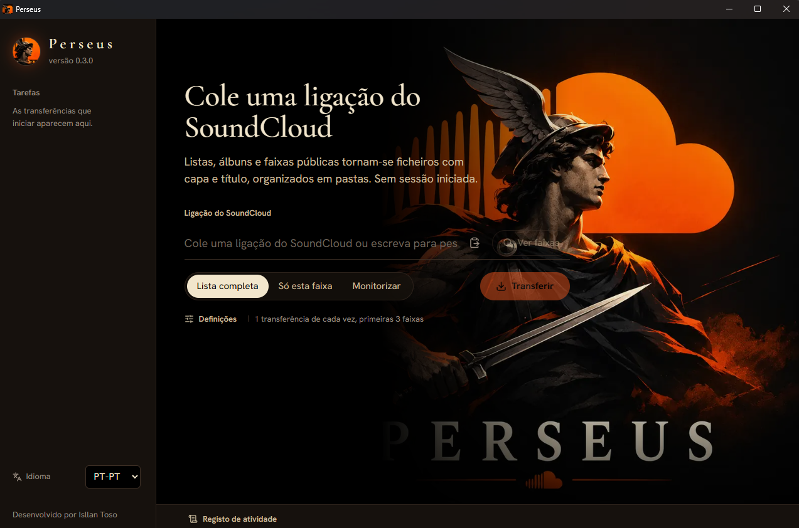

<p align="center">
  
</p>

<h1 align="center">Perseus</h1>

<p align="center">
  Downloader de faixas, álbuns e playlists públicas do SoundCloud, sem conta de usuário.<br>
  <em>Cole o link, veja as faixas, baixe com capa e título. E deixe ele de olho nas próximas.</em>
</p>

<p align="center">
  <a href="https://github.com/Isllanrx/Perseus/actions/workflows/ci.yml"></a>
  <a href="https://scorecard.dev/viewer/?uri=github.com/Isllanrx/Perseus"></a>
  <a href="https://github.com/Isllanrx/Perseus/releases/latest"></a>
  
  
</p>

<p align="center">
  <a href="https://github.com/Isllanrx/Perseus/releases/latest"><b>Download</b></a> ·
  <a href="https://github.com/Isllanrx/Perseus/issues"><b>Reportar um bug</b></a>
</p>

<p align="center">
  
</p>

O Perseus baixa faixas, álbuns, playlists e perfis públicos do SoundCloud e entrega arquivos prontos para ouvir:
título, artista, álbum, número da faixa e capa, organizados em uma pasta por playlist. Não precisa de conta nem de
login. No modo **Monitorar**, ele verifica a playlist em intervalos regulares e baixa só as faixas novas.

Núcleo em **Rust** (tokio), janela **Tauri 2** e interface **React**: um instalador de ~5 MB, sem servidor local
nem subprocessos. Também há uma [versão online](docs/versao-online.md) que roda no navegador, inclusive no celular.

> [!IMPORTANT]
> **Projeto educacional.** O Perseus baixa apenas streams abertos que qualquer visitante anônimo consegue
> reproduzir no site. Ele **não contorna DRM**: streams criptografados e prévias de 30 segundos do SoundCloud Go+
> são recusados por design. Respeite os [Termos de Uso do SoundCloud](https://soundcloud.com/terms-of-use) e os
> direitos autorais dos artistas. Veja o [Aviso legal](#aviso-legal).

## Recursos

- **Tudo o que o SoundCloud expõe sem login:** faixas, álbuns, playlists (inclusive privadas com `secret_token`),
  shortlinks `on.soundcloud.com`, abas do perfil (enviadas, populares, reposts, curtidas, álbuns, playlists),
  faixas relacionadas e busca por nome.
- **Veja antes de baixar:** a lista mostra, antes do download, quais faixas estão indisponíveis e por quê (DRM,
  prévia do Go+, bloqueio regional).
- **Qualidade:** *Compatível* (MP3) ou *Melhor* (maior bitrate aberto, como AAC 160 kbps).
- **Nada é baixado duas vezes:** arquivo de controle por pasta, biblioteca local que copia faixas já baixadas
  em outra pasta sem usar a rede, e retomada por HTTP Range se a conexão cair.
- **Arquivos íntegros:** cada faixa é validada antes de receber o nome final; tags ID3v2.3, MP4 ou Opus com
  ISRC, gênero, gravadora e capa em 500x500 ou original.
- **Organização:** template de nome, filtros de duração, playlist `.m3u8` e sincronização que move para
  `Removed\` o que saiu da playlist, sem nunca apagar arquivos.
- **Rápido:** downloads paralelos, segmentos HLS em paralelo e conexões HTTP/2 reaproveitadas.
- **Aplicativo e CLI**, interface em 11 idiomas (inclui árabe em RTL) e logs estruturados em JSON.

Comparação com scdl, yt-dlp e outras ferramentas em [docs/comparativo.md](docs/comparativo.md).

## Instalação

Requer Windows 10 ou 11 (64 bits). O instalador baixa o Microsoft WebView2 se ele faltar.

1. Baixe `Perseus_<versão>_x64-setup.exe` em [Releases](https://github.com/Isllanrx/Perseus/releases).
2. Confira a integridade com o `SHA256SUMS` publicado na release:

   ```powershell
   Get-FileHash .\Perseus_<versão>_x64-setup.exe -Algorithm SHA256
   ```

3. Execute o instalador. Ele instala só para o seu usuário, sem pedir administrador.

Para a linha de comando, extraia `perseus-cli.exe` de `perseus-cli-<versão>-win-x64.zip` em uma pasta do `PATH`.

> [!NOTE]
> Enquanto o instalador não tiver assinatura de código, o SmartScreen pode avisar na primeira execução
> (**Mais informações** → **Executar assim mesmo**). Confira sempre o SHA-256 antes.

## Uso

### Aplicativo

1. Cole o link de uma faixa, álbum, playlist ou perfil, ou digite um nome e clique em **Buscar**.
2. Escolha o modo: **Playlist inteira**, **Só esta faixa** ou **Monitorar**.
3. Em **Ajustes**, defina pasta de destino, downloads simultâneos, qualidade, template do nome, filtros e opções
   de biblioteca, `.m3u8` e sincronização.
4. Clique em **Baixar**. O progresso aparece faixa a faixa; **Cancelar** interrompe na hora e **Abrir pasta** leva
   direto aos arquivos.

### Linha de comando

```powershell
perseus-cli "https://soundcloud.com/usuario/sets/playlist"                 # playlist ou álbum
perseus-cli --info "https://soundcloud.com/usuario/sets/playlist"          # só metadados e disponibilidade
perseus-cli "https://soundcloud.com/usuario/likes" --quality best --max-duration 900
perseus-cli --search "flickermood"                                          # buscar e escolher
perseus-cli URL --name-template "{artist} - {title} [{id}]" --sync
perseus-cli URL --watch --interval 120                                      # monitorar a cada 2 minutos
perseus-cli URL --workers 8 --log-format json --report-json report.json     # automação
```

Todas as opções: `perseus-cli --help`. Variáveis opcionais: `SOUNDCLOUD_CLIENT_ID` (identificador manual) e
`PERSEUS_LOG` (filtro de log, sintaxe `tracing`).

| Código de saída | Significado |
| --- | --- |
| `0` | Sucesso |
| `1` | Sucesso parcial: rode de novo para tentar só as faixas que faltam |
| `2` | Entrada inválida |
| `3` | Falha de API ou de rede |
| `130` | Interrompido (Ctrl+C) |

## Onde o Perseus guarda arquivos

```text
%LOCALAPPDATA%\Perseus\                 aplicativo, cache (12 h), data\library.json e data\logs\ (últimos 7 dias)
%USERPROFILE%\Music\Perseus\            destino padrão
├── <Artista> - <Playlist>\             .perseus-archive.json, <Playlist>.m3u8 e Removed\ (--sync)
└── Single Tracks\                      faixas avulsas
```

## Solução de problemas

| Sintoma | O que verificar |
| --- | --- |
| Faixa "protegida por DRM" ou "apenas prévia de 30s" | Não é um bug: o Perseus não contorna DRM nem baixa prévias do Go+ |
| "bloqueada para a sua região" ou "não retornada pela API" | A faixa é restrita no seu país, é privada ou foi removida |
| "Não foi possível obter um client_id válido" | Verifique conexão e proxy; se persistir, use `SOUNDCLOUD_CLIENT_ID` e abra uma issue |
| Algumas faixas falharam (código `1`) | Rode de novo: só o que falta é baixado |
| O aplicativo não abre | A caixa de diálogo indica o motivo e a pasta de logs; reinstalar reinstala o WebView2 |

Ao abrir uma issue, anexe o log da execução (`%LOCALAPPDATA%\Perseus\data\logs` ou `--log-file` na CLI) e o
`run_id` mostrado no resumo.

## Segurança

O Perseus não abre portas, não coleta telemetria, só aceita links de `soundcloud.com`, só baixa via HTTPS de hosts
de mídia do SoundCloud e nunca apaga arquivos seus. Nomes de arquivo são saneados para que nenhum título escape da
pasta de destino. Relate vulnerabilidades de forma privada: [SECURITY.md](SECURITY.md).

## Desenvolvimento

Requer [Rust 1.90+](https://rustup.rs/) (toolchain MSVC no Windows) e [Node.js 24+](https://nodejs.org/).

```powershell
npm ci; npm ci --prefix web          # dependências
npm run dev                          # aplicativo com hot reload
npm run build                        # instalador em target\release\bundle\nsis\
pwsh scripts/test-all.ps1            # todas as suítes (-Sanity rápido, -Full com fuzz, desempenho e mutação)
```

| Documento | Conteúdo |
| --- | --- |
| [CONTRIBUTING.md](CONTRIBUTING.md) | Validação, suítes de teste, padrões, CI/CD e release |
| [docs/context](docs/context) | Arquitetura, regras de negócio, segurança, padrões e glossário |
| [docs/decisions](docs/decisions) | Decisões de arquitetura e o porquê de cada uma |
| [docs/versao-online.md](docs/versao-online.md) | Publicação na Vercel e custos do plano Hobby |
| [scripts/README.md](scripts/README.md) / [xtask/README.md](xtask/README.md) | Automação local e política de comentários |

## Aviso legal

O Perseus é publicado **para fins educacionais**: um estudo de como construir um downloader com engenharia segura.
Não é um produto comercial.

- O software é fornecido **"como está", sem garantia de nenhum tipo**, conforme a licença MIT, e **o autor não
  assume responsabilidade** por danos causados pelo uso, modificação ou redistribuição.
- Baixar conteúdo do SoundCloud pode violar os Termos de Uso do serviço e os direitos dos artistas. **Você decide se
  vai usar e arca com as consequências.** Baixe apenas o que você tem direito de guardar.
- O Perseus não contorna DRM nem qualquer outra medida técnica de proteção.
- O Perseus não é afiliado, endossado nem patrocinado pelo SoundCloud. SoundCloud e o logotipo são marcas do
  SoundCloud Global Limited & Co. KG.

## Licença

[MIT](LICENSE). Desenvolvido e mantido por **Isllan Toso** ([isllan.dev](https://isllan.dev/)). Construído sobre
[Tauri](https://tauri.app/), [tokio](https://tokio.rs/), [reqwest](https://github.com/seanmonstar/reqwest),
[lofty](https://github.com/Serial-ATA/lofty-rs), [m3u8-rs](https://github.com/rutgersc/m3u8-rs),
[React](https://react.dev/) e [Vite](https://vite.dev/).
